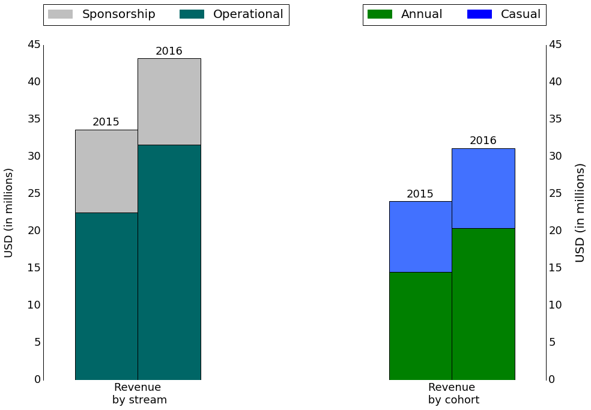
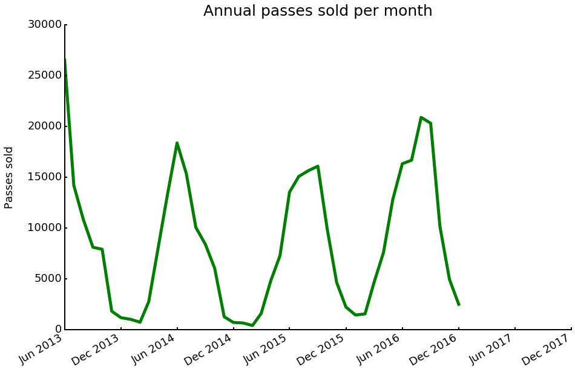
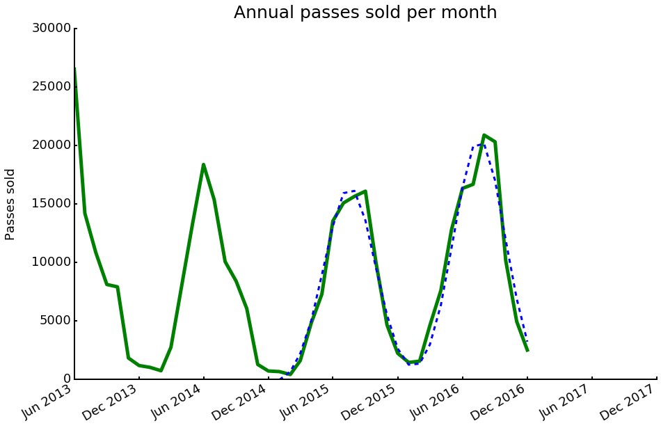
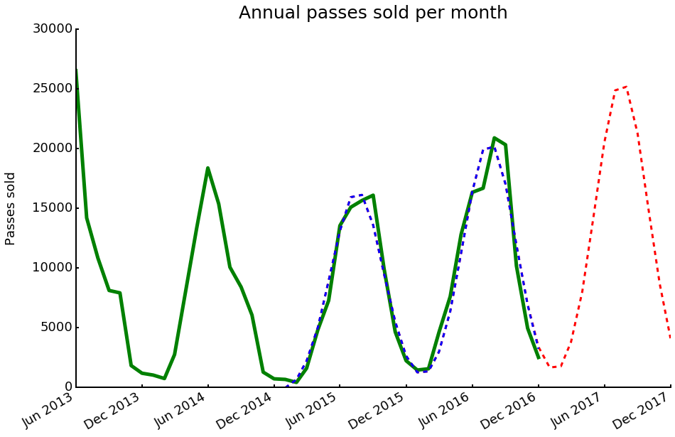
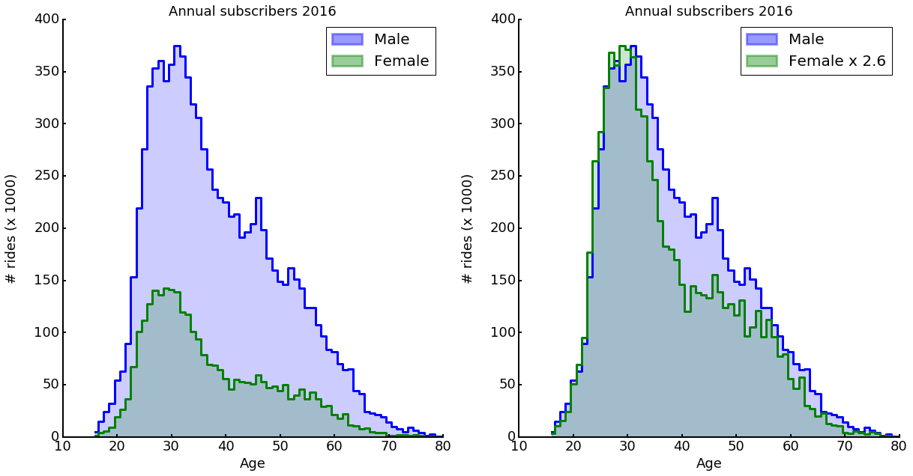
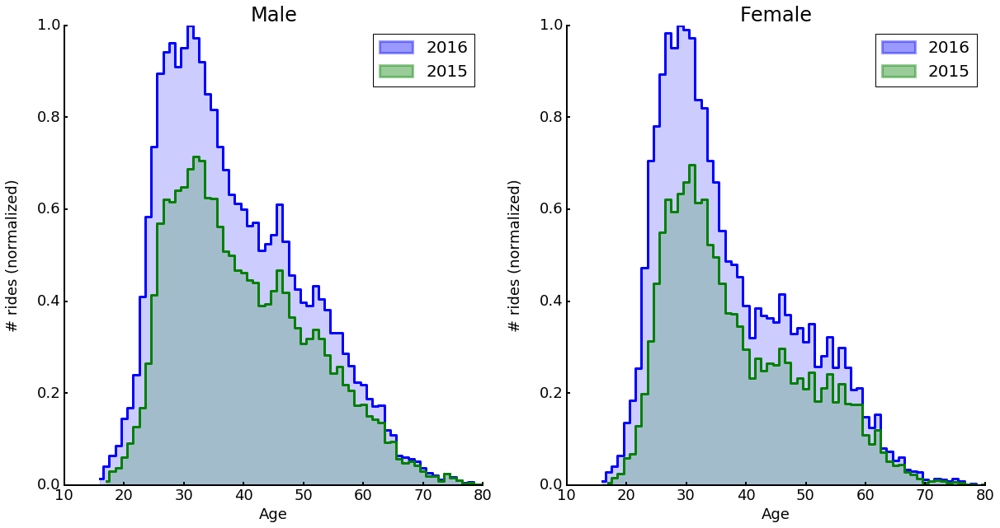
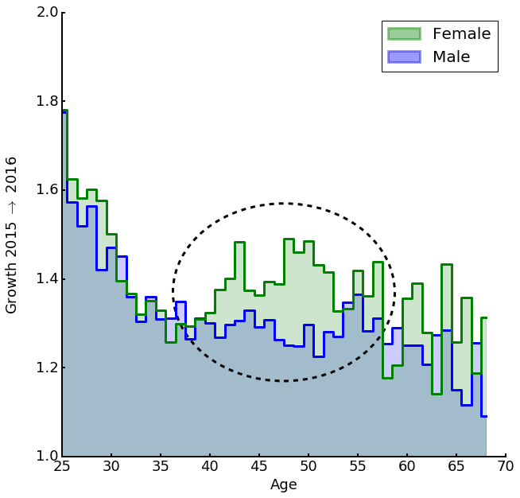

# An Analysis of Citi Bike
## Revenue forecasting and customer growth potential

## Introduction

Citi Bike (https://www.citibikenyc.com/) is a bike-sharing program in New York City. They operate several hundred stations across mostly Manhattan and Brooklyn where customers can collect bikes and return them to any station after use.

The customer model currently distinguishes between annual customers (subscribers) and casual customers (1-day and 3-day passes). During the timeframe determined by the pass, the customer may take as many rides as desired. The duration of any single ride, however,
is limited.

At the end of 2016, Citi Bike had approximately 120,000 active annual subscribers and recorded just shy of 14 million rides that year. The total annual revenue eclipsed 40 million USD in 2016.

## Goals

A key metric for almost any business is current performance compared to expected performance. This allows decision makers to be constantly informed about the
current state of the business and initiate action if required.

In a naturally seasonal business like Citi Bike (especially considering the location), forecasting expected performance is non-trivial. Simply comparing to previous months ignores the seasonality, while comparison with previous years may ignore growth trends or targets.

My first goal is therefore

* to provide a robust forecast of expected business performance.

A thorough understanding of the existing customers can yield important insights that allow to tap into new growth opportunities without requiring (potentially risky) geographical expansion. My second goal in this report therefore is

* to identify customer segments with the most potential to grow.

## Executive Summary

Using monthly revenue data from 2015 and 2016, I was able to build a model that captures the seasonality as well as the observed year-over-year growth. Using the learned model parameters, I can forecast the monthly performance. This forecast can be used as a key indicator to track business performance.

A demographic study of the annual subscribers in 2015 and 2016 reveals that female customers of age 35 years and up are a very promising customer segment for growth. This customer segment is underrepresented when compared to their younger peers, but showed increased growth from 2015 to 2016. Harnessing this growth momentum could yield an additional 4,300 annual customers, equaling a boost of revenue on the order of 700,000 USD.

## Data

The data used to drive these insights are publicly provided directly by Citi Bike ([System Data](https://www.citibikenyc.com/system-data)). They mainly consist of

* Monthly operating reports provided in PDF format
* A database of all rides taken (as .csv files)

The latter files can also be accessed via [Google Big Query](https://bigquery.cloud.google.com/table/bigquery-public-data:new_york.citibike_trips)

While the first set of data provides numbers on sales and revenue, the second set provides information on individual rides and on user demographics. Unfortunately, information does not cross over between both sources and the data as they are described above do not allow tracking of individual customers. This currently excludes any studies on customer churn or retention. However, the data set is still extremely powerful and allows me to expose highly relevant metrics for the business operation.

## Revenue streams

For the sake of this analysis, the yearly revenue stream can be divided into operations revenue (sales of passes) and revenue from sponsorship fees.

The 30% growth in revenue between 2015 and 2016 is almost entirely carried by the operational revenue increase. And within the operational stream, annual customers drive a majority of the revenue and most of the growth.

In combination with the intrinsic value of annual members for a subscription-based business like Citi Bike, I will focus my analysis on annual customers only.

> Annual customers drive the majority of the operational revenue and most of the growth.

## Monthly revenue trends

The monthly operating reports provide information on the number of annual passes that have been sold that month.

The strong strong seasonality is again very obvious and makes a meaningful sales forecast non-trivial, in particular when combined with an additional growth expectation.

Focussing on the years 2015 and 2016 only (the most stable years in terms of Citi Bike's business operations and leadership), a the observed trends can be fit well with a model consisting of two Gaussian components.

The model captures the seasonality and a growth trend well and using the learned parameters I can create a forecast for the year 2017.

This forecast make predictions about sales performance of annual passes under the assumption of static growth. This forecast metric can now be compared to actual monthly sales data. Significant deviations from the expected sales allow timely action to increase sales volume (e.g., marketing campaigns) or adjust growth expectations. The model can also take into account the newest data or business goals and update the forecast accordingly.

## Rides vs. customers

Before moving on to the second goal of this report, I have to establish the solid relation between 'number rides taken' and 'number of active annual customers'.

On a monthly basis, the ratio of *number of rides taken by subscribers* (from the 'rides' data base) and the *number of active subscribers in the same month* (from the operating reports) show the expected seasonality.

More importantly, taking a yearly aggregate reveals that the number of rides taken by each customer remained - on average - constant within 10% between 2015 and 2016.

> The number of rides faithfully describes the number of customers.

This result will be extremely helpful in the following analysis.

## User demographics

The Citi Bike data base provides demographic information (age, gender) for all rides taken by subscribers.

The age distribution for male and female subscribers is similar in shape, but male subscribers are responsible for 2.6 times (peak ratio) as many rides as female subscribers.

Scaling the distribution of the female subscribers to the same peak hight as the male subscribers reveals an obvious mismatch in the demographic rider profile. While younger women (20 to 35 years of age) show a similar engagement profile as men (modulo the overall scaling of 2.6), women at ages 35 to 55 are less enagaged than their younger peers.

> Drop in engagement for female subscribers of 35 to 55 years of age as compared to their younger peers.

This immediately suggests a potential action:

---
**Action** 
Increase engagement for female subscribers with ages 35 and up.

---

Support for this action comes from the growth Citi Bike has seen in the previous two years.

Engagement by male and female subscribers has grown from 2015 to 2016 across all ages. The growth ratio is very similar between between both user cohorts, except for the age bracket of 35 to 55 years. At these ages, engagement among women actually grew stronger over the last two years than for their men.

> Engagement among women 35 to 55 years of age grew stronger from 2015 to 2016 than for their male peers.

---
**Action** 
Harness the momentum seen for women at ages
35 to 55 and grow this cohort towards the level seen
for their younger peers.

---

Potential: 
Assuming that engagement among women at ages 35 to 55 can be increased to the same engagement profile as for their male peers (i.e., filling in the missing shoulder on the engagement histogram shown above), an additional 4,300 annual subscribers would be gained, translating into an increase in revenue on the order of $700,000 USD.
