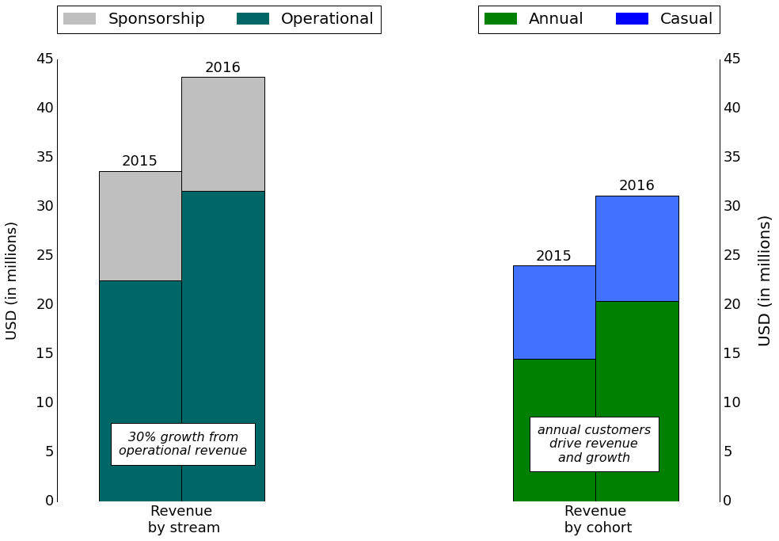

# An Analysis of Citi Bike
## Revenue forecasting and customer growth potential

## Introduction

Citi Bike (https://www.citibikenyc.com/) is a bike-sharing program in New York City. They operate several hundred stations across mostly Manhattan and Brooklyn where customers can collect bikes and return them to any station after use.

The customer model currently distinguishes between annual customers (subscribers) and casual customers (1-day and 3-day passes). During the timeframe determined by the pass, the customer may take as many rides as desired. The duration of any single ride, however,
is limited.

At the end of 2016, Citi Bike had approximately 120,000 active annual subscribers and recorded just shy of 14 million rides that year. The total annual revenue eclipsed 40 million USD in 2016.

## Goals

A key metric for almost any business is current performance compared to expected performance. This allows decision makers to be constantly informed about the
current state of the business and initiate action if required.

In a naturally seasonal business like Citi Bike (especially considering the location), forecasting expected performance is non-trivial. Simply comparing to previous months ignores the seasonality, while comparison with previous years may ignore growth trends or targets.

My first goal is therefore

* to provide a robust forecast of expected business performance.

A thorough understanding of the existing customers can yield important insights that allow to tap into new growth opportunities without requiring (potentially risky) geographical expansion. My second goal in this report therefore is

* to identify customer segments with the most potential to grow.

## Executive Summary

Using monthly revenue data from 2015 and 2016, I was able to build a model that captures the seasonality as well as the observed year-over-year growth. Using the learned model parameters, I can forecast the monthly performance. This forecast can be used as a key indicator to track business performance.

A demographic study of the annual subscribers in 2015 and 2016 reveals that female customers of age 35 years and up are a very promising customer segment for growth. This customer segment is underrepresented when compared to their younger peers, but showed increased growth from 2015 to 2016. Harnessing this growth momentum could yield an additional 4300 annual customers, equaling a boost of revenue on the order of 700,000 USD.

## Data

The data used to drive these insights are publicly provided directly by Citi Bike ([System Data](https://www.citibikenyc.com/system-data)). They mainly consist of

* Monthly operating reports provided in PDF format
* A database of all rides taken (as .csv files)

The latter files can also be accessed via [Google Big Query](https://bigquery.cloud.google.com/table/bigquery-public-data:new_york.citibike_trips)

While the first set of data provides numbers on sales and revenue, the second set provides information on individual rides and on user demographics. Unfortunately, information does not cross over between both sources and the data as they are described above do not allow tracking of individual customers. This currently excludes any studies on customer churn or retention. However, the data set is still extremely powerful and allows me to expose highly relevant metrics for the business operation.

## Monthly revenue trends

## User demographics
